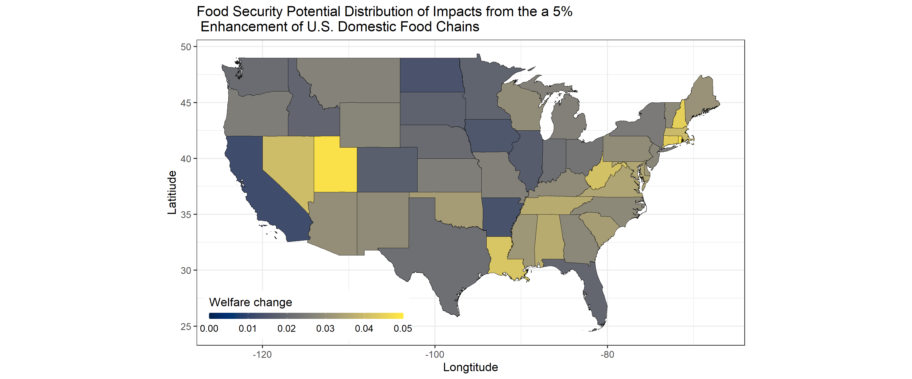

# infra_invest_on_US_food_secur repository

**Description**: This repository performs a general equilibrium welfare analysis derived from a gravity model of domestic between all U.S. states. Then, it describes the results from a counterfactual that emulates the distributional effects of president Biden's infrastructure investment on U.S. food security.

**Counterfactual results**: A simulation creates a counterfactual that reduces bilateral trade costs between all U.S. states by 5% to study welfare distribution in U.S. states. I find that *all* U.S. states benefit from enhancements in the food supply chain distribution, but with significant heterogeneity likely derived from U.S. states' reliance on imports (Dall'Erba, Chen, Nava 2021; Nava, Ridley and Dall'Erba submitted in AJAE). Interestingly, the largest beneficiaries are not the states with high agricultural productivity such as IL and CA, but states whose food consumption comes from outside sources such as Nevada and Louisiana. The picture below shows my counterfactual results.

**Further consideration and caveats**: Counterfactual results from this analysis rely on assumptions and simplifications discussed in Nava, Ridley and Dallerba (working paper submitted in AJAE). In addition, little consideration is done to the magnitude of the effect. An appropriate analysis should consider the magnitude. Despite its limitations, counterfactual results are informative about the welfare distributions of the simulations. For example, the obvious implication of Biden's infrastructure bill are gains, but there is significant heterogeneity in welfare gains that can be traced back to reliance on external sources. 

The author is open to collaborations and suggestions to advance this work.

All mistakes are my own.

**References:**

Baier, Yotov, and Zylkin .2019. *On the Widely Differing Effects of Free Trade Agreements: Lessons from Twenty Years of Trade Integration*, **Journal of International Economics** 116: 206-226.

Dall'Erba Sandy, Chen Zhangliang, Nava Noé J. 2021. *U.S. interstate trade will mitigate the negative impact of climate change on crop profit*, **American Journal of Agricultural Economics** 00(00): 1-22.

Nava Noé J, Ridley Bill, Dall'Erba Sandy. *Who benefits from local agriculture?*, submitted for publication consideration in the **American Journal of Agricultural Economics**

**Suggested citation**

Nava Noé J, Ridley Bill, Dall'Erba Sandy. *Who benefits from local agriculture?*, submitted for publication consideration in the **American Journal of Agricultural Economics**

